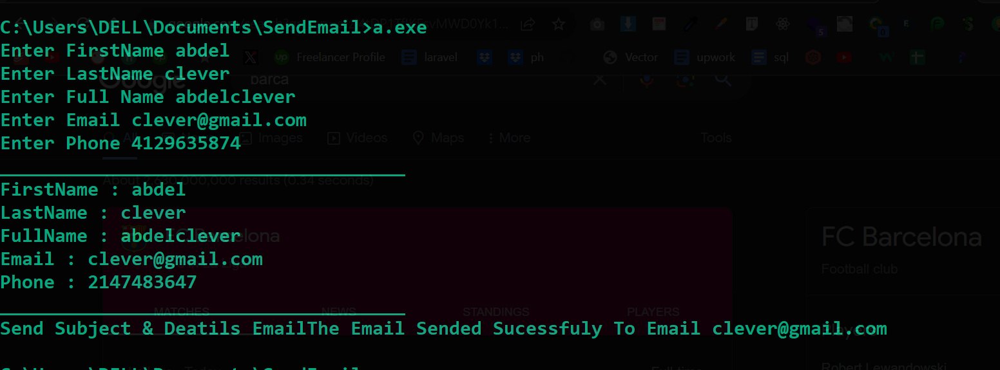

# SendEmail

<h2>SendEmail Project using Object Orinted Programming</h2>

Data Member

<ul>
    <li>First Name</li>
    <li>Last Name</li>
    <li>Full Name</li>
    <li>Email</li>
    <li>Phone</li>
</ul>

Methods Member

<ul>
    <li>Print Full Name</li>
    <li>Send Message</li>
    <li>Send Email</li>
</ul>

<h2>Screenshot Project</h2>

